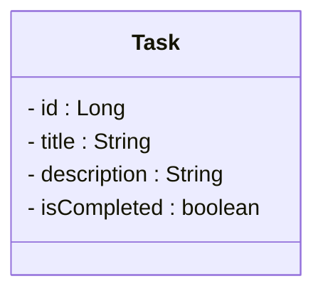

# <h1 align="center">To Do List</h1>

### <h3 align="center">Aplicação que permite a criação, atualização e remoção de tarefas.</h3>

</br>

<div align="center">
  


</div>

</br>

## Tabela de conteúdos

<p>
 <a href="#status-do-projeto">Status do Projeto</a> •
 <a href="#features">Features</a> • 
 <a href="#aplicacao">Aplicação</a> • 
 <a href="#como-rodar">Como rodar a aplicação</a> • 
 <a href="#licenc-a">Licença</a> • 
 <a href="#autor">Autor</a>
</p>

</br>

<a id="status-do-projeto"></a>
## Status do projeto
### ✅ Concluído

</br>

<a id="features"></a>
## Features
- [x] Inserção de tarefas
- [x] Retorno de tarefas
- [x] Retorno de tarefas por id
- [x] Atualização de tarefas
- [x] Atualização de status da tarefa
- [x] Remoção de tarefas

</br>

<a id="aplicacao"></a>
## Aplicação

### Página principal


</br>

### Página para inserção de novas tarefas


</br>

### Página para atualização de tarefas


</br>

<a id="como-rodar"></a>
## Como rodar a aplicação

### Spring
- Requisitos: JDK 21
<p>Dentro da pasta `/todolist-spring`, rode os seguintes comandos:</p>

```
  mvn clean
  mvn install
```

- Rode o projeto na sua IDE de preferência

### Angular
- Requisitos: Node 20.10, AngularCLI 17.0
<p>Dentro da pasta `/todolist-angular`, rode os seguintes comandos:</p>

```
  npm install
  ng serve
```

- O servidor iniciará na porta 4200 - acesse `http://localhost:4200/`

</br>

## Diagrama de Classe

